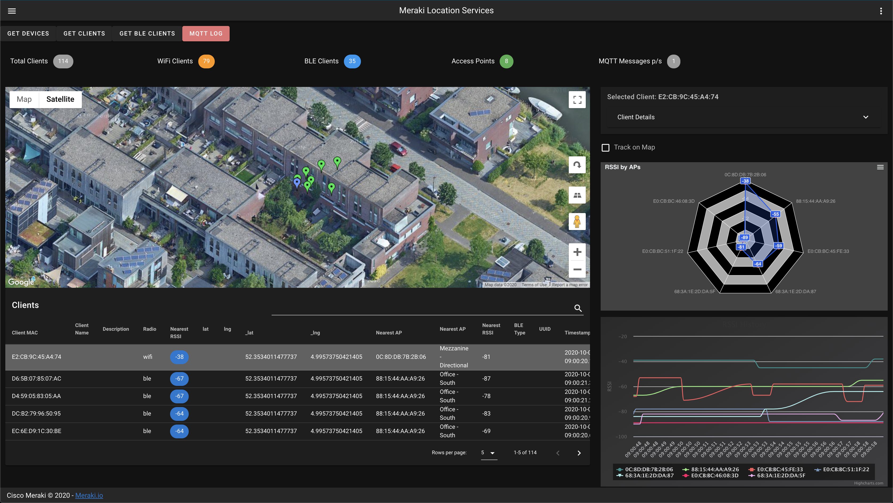

# meraki-mr-mqtt-location-demo

> A web tool for exploring the Meraki real-time telemetry sream

# About
The demo application connects to an MQTT stream via websocket and displays the details in various charts and maps. 




---


    


---

## Features
- Organization & Network selector to pull in additional Meraki details via the API
- Connects to an MQTT broker to deliver real-time telemtry information
- Client locations are computed with a trilateration function in the app
- Track WiFi and Bluetooth clients
  

## Build Setup

``` bash
# install dependencies
$ yarn install

# serve with hot reload at localhost:3000
$ yarn dev

# serve with API Key and Meraki API base URL
$ NUXT_ENV_API_KEY=<your-api-key> NUXT_ENV_API_URL="https://api.meraki.com/api/v0" yarn dev


# build for production and launch server
$ yarn build
$ yarn start

#generate static project
$ yarn generate
```

#  Dev Info

[NUXT Folder Structure Details](https://nuxtjs.org/guide/directory-structure)

## Configuration Files
```
# Theme and app configuration
nuxt.config.js

# Meraki API configurations
meraki.config.js
```

## Important App Files
```
# Pages ~ Start of app and dynamically routed pages

`pages/index.vue`

# Layout ~ Menu / Toolbar

`layouts/default.vue`

# Dashboard

`components/MqttDashboard.vue`

# Components ~ All of the actions and views 

`components/...`

# Routes ~ API Proxy Route for Meraki API

`/api`

```


## Built with
- [Nuxt.js / Vue.js](https://nuxtjs.org)
- [Vuetify](https://vuetifyjs.com)
- [Meraki API](https://meraki.io/api)
- [Node v10.13.0](https://nodejs.org/en/)


